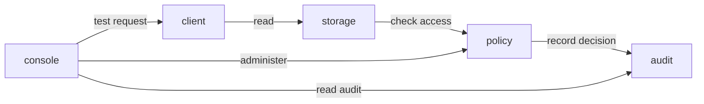

# TCS — Typed Capability System

TCS is a new operating system built from isolated, communicating servers on a microkernel substrate. Its security direction is explicit authority that can be reduced and restored under policy as conditions change.

Repository: [chasebryan/tcs](https://github.com/chasebryan/tcs). TCS replaces the working name CINIX. The project continues from the bootable seed developed under that name.

**Current milestone: 0.1.0 Seed.** Boots seL4/Microkit in AArch64 QEMU and runs five native protection domains. The boot scenario exercises access grants, per-request checks, session revocation, quarantine, recovery, and audit exhaustion across actual kernel IPC.

The seed console runs an automated scenario. A separate development profile now provides an interactive read-only terminal through an isolated PL011 serial server. Storage serves one read-only fixture. Persistent storage, signed updates, dynamic process creation, and a user login system come in later milestones. The typed capability design will extend the seed's versioned operation contracts; compile-time typed capability handles are not implemented yet.

Development toward milestone 0.2 includes a bounded [UART terminal](docs/TERMINAL.md), with no policy-admin channel and no command that grants authority. Follow [development checkpoints](docs/PROGRESS.md) for completed increments and the next acceptance gate. Interactive administration and authentication are not implemented.

## Run

Host tests require a C11 compiler, Make, and Python 3.9+:

```sh
make test
```

For the microkernel build, install QEMU (`qemu-system-aarch64`), then obtain the pinned SDK/compiler:

```sh
git clone https://github.com/chasebryan/tcs.git
cd tcs
make bootstrap
make test
make smoke
```

The same commands work on supported Linux x86_64/AArch64 and Apple Silicon hosts. The smoke test uses an emulated Cortex-A53, 2 GiB of guest RAM, one CPU, no network interface, and no attached disk. Success ends with `TCS SEED PASS`. It then stops its own QEMU process. See [build details](docs/BUILD.md) for prerequisites and a macOS SDK workaround.

To boot the included image without downloading a compiler or SDK, install QEMU and run `make smoke-saved`. This is a standalone bootable seed, not yet a complete general-purpose OS or an offline toolchain distribution.

For the new terminal, run `make terminal-smoke` for scripted real-UART tests or `make terminal-run` to use it. Commands: `help`, `version`, `status`, `read <generation>`. Input is echoed; Backspace/Delete edit and Ctrl-C cancels. Exit QEMU with **Ctrl-A, then X**. Reads are denied by default because this profile contains no administrator. `status` reports the caller's live policy state, generation, object, and rights; it cannot select another subject or grant access. `make terminal-smoke-saved` tests the included terminal image without a compiler, including injected serial breaks.

The separate **release-kernel terminal** disables the SDK's kernel/runtime debug-printing path: `make terminal-release-run` to use it, `make terminal-release-smoke` to rebuild/test, or `make terminal-release-smoke-saved` to test the included image without an SDK. Its banner identifies the profile. The same restricted server graph and commands apply; this is still a development OS, not a production release or a formal-verification claim. Debug seed and terminal targets remain available.

`make isolation-smoke` runs a separate [runtime isolation test image](docs/ISOLATION.md): six deliberate memory/device accesses must produce specific kernel faults while a policy-owned test page and live self-status remain intact. Normal images contain none of its probe/observer authority. `make isolation-smoke-saved` tests the included evidence image without an SDK.

The next administration layer now has a [signed-request core](docs/ADMIN.md), with real Ed25519 verification, per-instance replay checks, and policy-generation preconditions. A separate [boot-context test image](docs/BOOT-CONTEXT.md) executes the verifier in the guest with fresh host-generated launch identities and public test signatures: `make boot-test-smoke` or `make boot-test-smoke-saved`. It has no policy authority and is **not a live login or administration endpoint**. Operator provisioning and restart-safe integration remain mandatory gates.

A further [administration IPC test profile](docs/ADMIN-IPC.md) connects a separate administrator to policy and audit. `make admin-test-smoke` exercises 12 signed test commands and definitive execution receipts, including audit-failed revocation versus blocked grants; `make admin-test-smoke-saved` runs the included image. This uses public fixtures only and ends with a read-only terminal. It is not operator login or deployment provisioning.

## First server graph



Arrows are allowed protected calls. Kernel-assigned channel identities determine the caller's authority. The client has no policy-admin channel. Each storage operation checks its current subject, object, rights, and session generation before releasing the fixture.

The dynamic behavior currently changes application authorization inside a fixed kernel capability graph. Generation numbers are subject-bound session identifiers; they are not transferable seL4 capabilities. Seed revocation does not delete kernel capabilities, unmap memory, stop a process, or retract data already read. Those are later lifecycle requirements.

## Source map

| Path | Purpose |
| --- | --- |
| `system/tcs.system` | Five protection domains and their permitted communication paths |
| `system/terminal.system` | Six-domain terminal profile; UART mapping/IRQ only in the serial server |
| `servers/` | Freestanding native Microkit programs |
| `lib/policy.c` | Allocation-free policy state machine shared by runtime and host tests |
| `lib/terminal.c` | Bounded line editing and read-only command parsing used in the runtime |
| `lib/serial.c` | Bounded receive queue and explicit transport-loss handling |
| `include/tcs/` | Policy types and versioned IPC definitions |
| `tests/policy_test.c` | Invariants, negative cases, audit failure, counter exhaustion, transition sequences |
| `tools/` | Pinned toolchain retrieval, topology check, automated QEMU boot |
| `docs/` | Architecture, protocol, build instructions, roadmap, verification record |
| `artifacts/` | Saved image, transcript, construction report, and hash record |
| `third_party/` | Immutable upstream source archives and their provenance |

[Architecture](docs/ARCHITECTURE.md) · [IPC protocol](docs/PROTOCOL.md) · [Roadmap](docs/ROADMAP.md) · [Verification](docs/VERIFICATION.md) · [License](LICENSE) · [Upstream dependencies](NOTICE.md)

The [saved boot image and transcript](artifacts/README.md) can be inspected or run without rebuilding.
